# BetterTouchTool Touch Bar Presets

Here we collect cool touch bar presets for [BetterTouchTool](https://boastr.net). Feel free to send your own configs in pull-requests. Do not forget to attach a screenshot (⇧⌘6) and write some description to this README.

## Installation

After installing BetterTouchTool, you can import/export configurations from the Manage Presets button.

## Presets

### @vas3k: [vas3k_btt_v2.json](vas3k/vas3k_btt_v2.json)

Widgets:
- Smart Finder: opens a new Finder window in any situation
- Spotify Now Playing: shows the name of the track currently playing in Spotify
- VK and YouTube Now Playing
- Top reminder from Reminders.app
- Weather widget: temperature in current location (install [JSON Helper](https://itunes.apple.com/ru/app/json-helper-for-applescript/id453114608?l=en&mt=12) and [Location Helper](https://itunes.apple.com/ru/app/location-helper-for-applescript/id488536386?mt=12) to make it work)
- Coffee Break: lock screen button :)
- Convenient Play button: controls only Spotify and iTunes, not all that shit that macOS High Sierra do

### @ad: [ad_btt.json](ad/ad_btt.json)

Version 2 (with sliders):

[ad_btt_v2.json](ad/ad_btt_v2.json)

Version 3 (System info group, battery info is moved to the group to reduce the consumption of system resources):

[ad_btt_v3.json](ad/ad_btt_v3.json)

### @ReDetection: [redetection_v1.1.json](redetection/redetection_v1.1.json)

Widgets:
- Click on VK and YouTube widgets opens their specific tab
- Geeky weather

### @podkovyrin: [podkovyr_btt.json](podkovyrin/podkovyr_btt.json)

Widgets:
- Auto-hidden next track button

### [@toxblh](https://github.com/Toxblh/btt-touchbar-preset): [toxblh.json](toxblh/toxblh.json)

Version 1: [toxblh_v1.json](toxblh/toxblh_v1.json)

Widgets:  

Presets:
1. Finder
2. Bright up/down
3. What now playing for iTunes, Spotify and VOX. Next by press.
4. I want a coffee!
5. Weather - Local the weather
6. Volume up/down
7. Play/Pause - Work only with iTunes, Spotify and VOX
9. Battery status
10. Time - simple a time

### @surpher: [xcode-dev.json](surpher/xcode-dev.json)

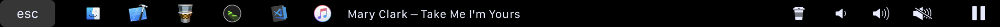

[system-controls.json](surpher/system-controls.json)  

Widgets:
1. Now playing for iTunes, tap to _Next_
2. YouTube playing in Safari
3. YouTube playing in Chrome

Presets:
1. Finder
2. Xcode
3. Git-Tower
4. iTerm2
5. iTunes/YouTube widget
6. Coffee time!
7. Volume down/up
8. Mute/Unmute
9. Play/Pause
10. System Controls button group (preset)

### @danruss: [danruss_btt.json](danruss/danruss_btt.json)

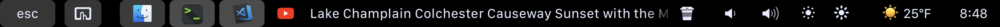
Widgets:
1. YouTube playing in Chrome
2. Now playing in Spotify
3. Reminders: Last Reminder

Presets Left:
1. Finder
2. Terminal
3. Visual Studio Code

Presets Right:
1. Coffee - Sleep Computer
2. Volume Down
3. Volume Up
4. Brightness Down
5. Brightness Up
6. Weather - Weather Icon + Temp F
7. Time - H:mm

### @gillesdubois: [gillesdubois_btt.json](gillesdubois/gillesdubois_btt.json)

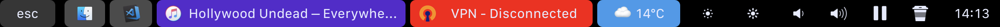
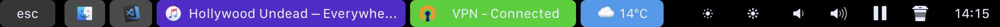
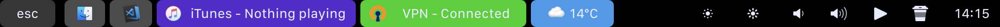

Presets Left:
1. Finder
2. Visual Studio Code
3. iTunes : Now Playing
3. VPN Status - Tap to connect / disconnect (Tunnelblick)
4. Weather - Weather Icon + Temp C°

Presets Right:
1. Brightness Down
2. Brightness Up
3. Volume Down
4. Volume Up
5. Play / Pause
6. Coffee - Sleep Computer
7. Time - H:mm

* [Click here from more informations and how to setup](gillesdubois/README.md)

### @pavopax: [touchbar-preset.json @ pavopax/dotfiles](https://github.com/pavopax/dotfiles/blob/master/touchbar-preset.json)

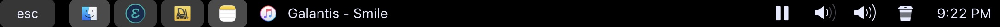

Left:
1. [Forklift](https://www.binarynights.com/forklift/)
1. TextEdit
1. Emacs ([icons](http://emacs.sexy/#icons))
1. Notes

Middle widget:
1. iTunes song, click to jump to next

Right:
1. Play/Pause
1. Volume down
1. Volume up
1. Coffee - sleep screen (*not* sleep computer)
1. Time as `h:mm a`

Misc:
1. Hold `Fn` key to access expanded control strip or press it to toggle BTT/app
   controls if available, via hack from [alexw.me - search "You can still
   access the Control
   Strip..."](https://alexw.me/2017/01/what-if-you-could-customize-your-new-touch-bar/)

### @vladionescu: [simple_snake.json](https://github.com/vas3k/btt-touchbar-presets/blob/master/vionescu/simple_snake.json)

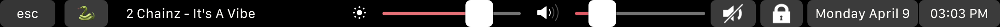

Left:
1. ESC
2. Emoji picker

Middle widget:
1. Spotify now playing, click to jump to next

The next song title appears immediately, it doesn't wait for the now playing script to run on its timer

Right:
1. Brightness down
2. Brightness slider
3. Volume down
4. Volume slider
5. Mute
6. Lock screen
7. Day Month Date
8. 12 hour clock

The brightness/volume up buttons were omitted from the slider in the interest of saving space, and because I use the slider to adjust and not the buttons. The buttons are effectively just icons to remind what each slider is for.

### @goldenchaos: [goldenchaos-btt.bttpresetcompressed](https://github.com/GoldenChaos/GoldenChaos-BTT/raw/master/goldenchaos-btt.bttpresetcompressed) (View [GoldenChaos/GoldenChaos-BTT](https://github.com/GoldenChaos/GoldenChaos-BTT))

#### Screenshot tour

The default set of keys if nothing is open; Fullscreen button doubles as escape key and always stays docked to the left

Contextual buttons and widgets populate the scrollable container as you open and close corresponding apps; Tap on any widget to open its parent app

Emoji and app switcher widgets take over the scrollable container

Hold down alt/option for an expanded control strip

#### Supported apps:

- Finder
- Safari
- Chrome
- Firefox
- iTunes
- Spotify
- YouTube (in Safari and as a Fluid app)
- Reminders
- Things 3
- Carrot Weather
- Calendar
- Fantastical 2

#### Nifty features:

- Thoughtfully considered UI and UX designed to *fully* replace the default Touch Bar
- Fullscreen button doubles as esc key, *always* stays docked to the left
- Two finger slide on the Touch Bar to change volume
- Three finger slide on the Touch Bar to change brightness
- Hold down Volume Down button to mute
- Hold Option/Alt to expand the function strip
- Emoji button toggles scrollable emoji widget
- App Switcher button toggles scrollable app switcher widget
- Date and Time widget toggles Fantastical 2 menu bar when pressed (uses Fantastical 2's default keyboard shortcut)
- Weather widget shows condition emoji + temperature in Fahrenheit, toggles Carrot menu bar when pressed (uses Carrot's default keyboard shortcut)
- Persistent Show Finder button for easy Finder access
- Persistent Maximize Left, Center Window, and Maximize Right controls for window management
- Refresh button appears next to Forward and Back buttons if Safari, Chrome, or Firefox is open
- Media controls and iTunes/Spotify widgets appear only when iTunes or Spotify is running
- Now Playing widgets show currently playing track info (with album art for iTunes!) or "Paused" if iTunes/Spotify are paused
- Due Today widget shows reminders from Reminders.app that are due today, overdue, or without a due date
- Reminders without a due date persist and automatically show the most recently added reminder
- Next Thing widget grabs your next reminder from Things 3
- Next Event widget uses [icalBuddy](http://hasseg.org/icalBuddy/) to get just today's upcoming calendar events (requires extra configuration)
- Tap on any widget to open its parent app

#### Required Plugins:

- [High Sierra Media Key Enabler](http://milgra.com/high-sierra-media-key-enabler.html) with "Pause if no player is running" enabled for media controls
- [Location Helper](http://www.mousedown.net/mouseware/LocationHelper.html) and [JSON Helper](http://www.mousedown.net/mouseware/JSONHelper.html) for the weather widget
- [icalBuddy](http://hasseg.org/icalBuddy/) for the calendar widget

#### Media Controls Configuration:

[High Sierra Media Key Enabler](http://milgra.com/high-sierra-media-key-enabler.html) with "Pause if no player is running" enabled is strongly recommended. Appropriate media controls are displayed conditionally based on the following hierarchy:

1. iTunes
2. Spotify
3. Safari (YouTube)

If no media player is running, and Safari is open to a YouTube video, only the Play/Pause button will be shown. In any other case, all media controls are available.

#### Calendar Widget Configuration

For the Calendar widget to work properly, it must first be edited to include the names of calendars you wish to display. Replace my personal defaults with yours, and make sure you've installed [icalBuddy](http://hasseg.org/icalBuddy/). You can also configure the widget to display events for additional days, for example for up to a week, by changing "eventsToday" to "eventsToday+7".

### @williamli (v1): [williamli_btt.v1.json](williamli/williamli_btt.v1.json)

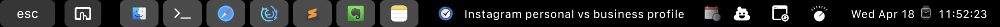
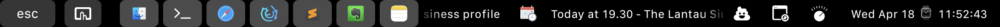
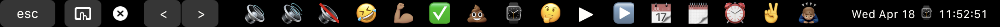
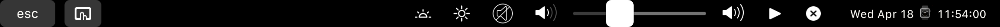

Presets Left:
1. (AppleScript) Finder, tell Finder to open in focus, switches Space if it has to.
2. Terminal
3. Safari
4. Firefox Developer Edition
5. SublimeText
6. Evernote
7. Notes

Center:
1. (Widget) Show next todo for "Today" (if any) in *Things 3*, tap to launch.
2. (Widget + all) Show the next appointment within next 7 days (if any), tap to launch *Fantastical 2*, can be reprogrammed to launch Calendar. Require free cli app [icalBuddy](http://hasseg.org/icalBuddy/) to access Calendar info. Configured to use "Relative Date".
3. (Widget) YouTube playing in Safari, tap to focus app / tab.
4. (Widget) iTunes Now Playing, tap to launch iTunes.
5. (Widget) Spotify Now Playing, tap to launch Spotify.

Presets Right:
1. (Folder) Emojis 💩
2. (Folder) App Switcher
3. (Folder) Media Controls
4. Ticking Clock - Week Month Date ⌚ Hour:Minute:Second

### @claydugo: [clay-btt.json](https://github.com/claydugo/btt-touchbar/blob/master/clay-btt.json)

Widgets:
1) App Switcher

Presets:
1) Open Finder to home directory (will have to edit to your own home directory)
2) Open current directory in Sublime Text
3) Open Better Touch Tool Color Picker
4) Take screenshot and edit in Better Touch Tool
5) Coffee Break/Lock Screen
6) Date/Time Widget (Press to toggle Better Touch tool)

[Settings](https://github.com/claydugo/btt-touchbar/blob/master/README.md)

### @ [canato](https://stackoverflow.com/users/3117650/canato?tab=profile): [CanatoAmazingTouchBar.json](https://gitlab.com/Canato/AmazingTouchBar.git)

1. **Coffe Break**: Lock the Screen;

2. **Keep Icon:** Open my Google Chrome and the Keep page (*normally I use safari, but not for this, if is already open just show Google Chrome*);

3. **Play/Pause:** Stop and Play Music in Spotify and iTunes. If nothing is open, it open the spotify (*first click*) and play music (*second click*);

4. **Show Music/Video:** Here it display the music Spotify/iTunes or the video on Youtube that you are watching/listening;

5. **Weather**: Funny here, because it show the weather with a nice icon, I change click the behavior. Don’t open the weather website but **clean the trash can**;

6. **Mouse Battery**: Very obvious, before it had a icon, but I removed because was only wasting space;

7. **Hour**: Show the “current” time, one of the best feats! But when you click I “made it to” **take screenshots**

   [Medium post for lazy friends](https://medium.com/@vcanato/making-macbook-touchbar-really-amazing-2a8d9118a9c0)

## Useful links

* [Original blog post (EN)](http://vas3k.com/blog/touchbar/)
* [Original blog post (RU)](http://vas3k.ru/blog/touchbar/)
* [Reddit: Share your BetterTouchTool touchbar shortcuts](https://www.reddit.com/r/apple/comments/6wdfvo/share_your_bettertouchtool_touchbar_shortcuts/)

## License

Licensed under the [WTFPL](http://www.wtfpl.net/) license.
Full text of the license can be found in the LICENSE.txt file.

> [vas3k.com](http://vas3k.com) &nbsp;&middot;&nbsp;
> GitHub [@vas3k](https://github.com/vas3k) &nbsp;&middot;&nbsp;
> Twitter [@vas3k](https://twitter.com/vas3k)
