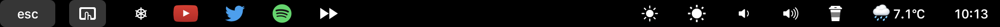
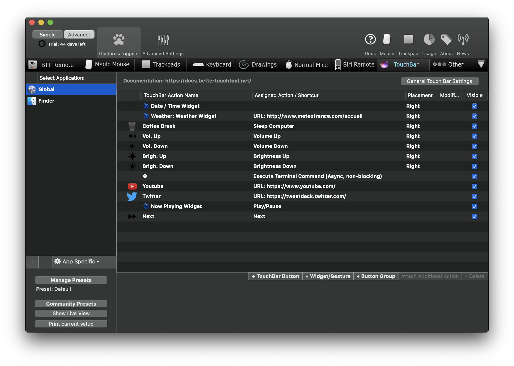

# Better-Touch-Tool-Custom

## My presets
  1. Open your favorites soft
  
  2. Open Youtube URL
  
  3. Open tweetdeck URL
  
  4. Open Spotify/pause/play
  
  5. Next button
  
  6. Brightness down
  
  7. Brightness up
  
  8. Volume down
  
  9. Volume up
  
  10. Coffee break - Sleep computer
  
  11. Weather widget
  
  12. Time widget
  
